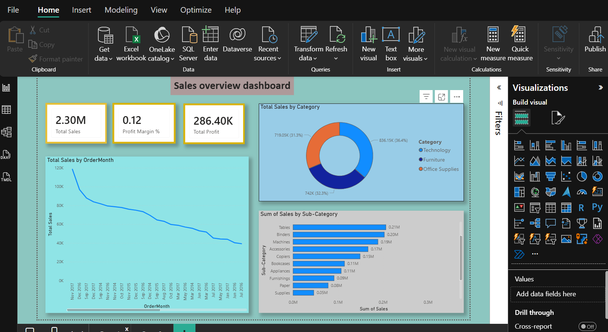

# Power-BI-Dashboad
 Perfect! Here’s a **detailed and professional README** you can use for your GitHub repo. I’ve structured it clearly, with sections for overview, features, files, and usage. You can copy it directly and edit if needed:

---

# **Sales Dashboard – Power BI**

## **Overview**

This repository contains a **Sales Dashboard** created in **Power BI Desktop**. The dashboard provides interactive visualizations of key sales metrics, allowing users to analyze sales performance by month, product, and region. It is designed for **data analysis practice, business insights, and portfolio demonstration**.

---

## **Features**

* **KPI Cards**: Quickly view total sales, revenue, and growth metrics.
* **Bar, Line, and Donut Charts**: Visualize monthly sales trends, product category performance, and regional contributions.
* **Interactive Slicers**: Filter data by **Region**, **City**, **Product**, or **Month** for dynamic insights.
* **Professional Design**:

  * Clean visual borders
  * Consistent color scheme
  * Optional light page background
  * Footer included on additional pages

---

## **Files in this Repository**

* **SalesDashboard.pbix** – Editable Power BI file containing all visuals and data model.
* **SalesDashboard.pdf** – Static export of the dashboard, ready to share or present.

---

## **Getting Started**

1. **Power BI Desktop** is required to open the `.pbix` file. You can download it [here](https://powerbi.microsoft.com/desktop/).
2. Open `SalesDashboard.pbix` in Power BI Desktop to explore, modify, or add visuals.
3. To view the dashboard without Power BI, use the `SalesDashboard.pdf` file.

---

## Screenshots

---

## **Usage**

* Analyze monthly and category-wise sales trends.
* Filter by region, product, or month using slicers.
* Use this as a **portfolio project** to demonstrate Power BI skills in data visualization and reporting.

---

## **Author**

**Akarsh Tyagi**

* Portfolio: [GitHub Profile](https://github.com/yourusername)
* Email: akarshtyagi2004@gmail.com

 
Do you want me to do that?
